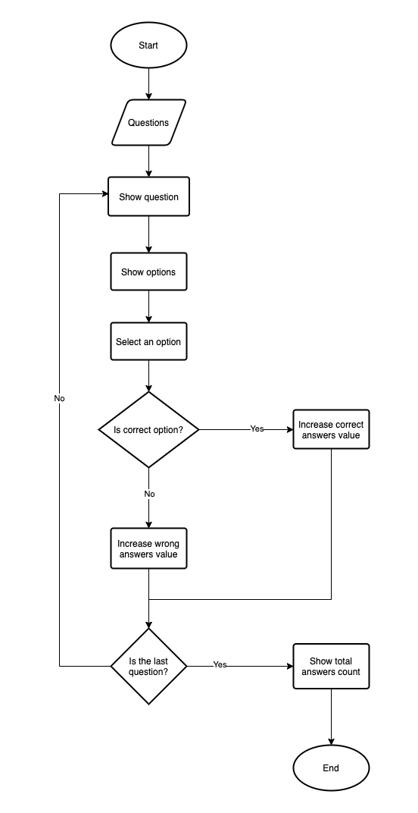
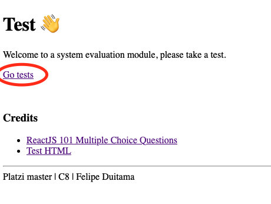
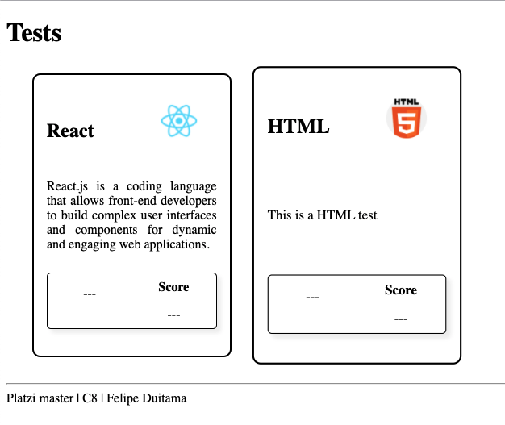
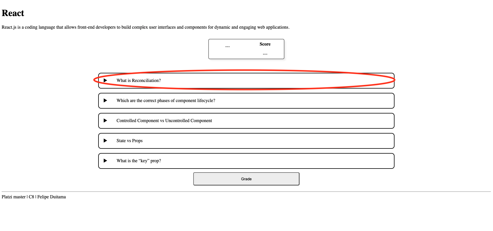
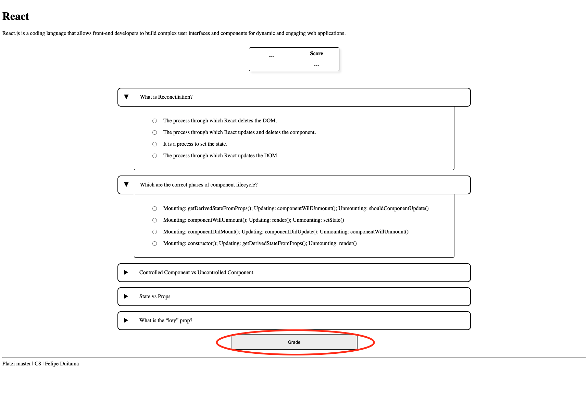
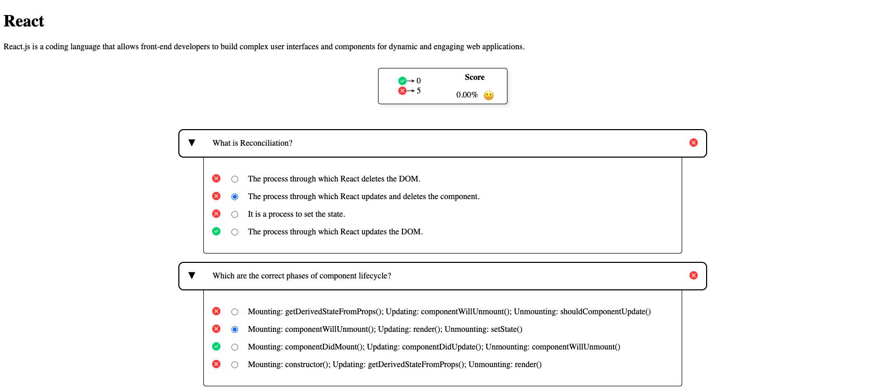

# Evaluation system

This is a module for a evaluation system that lets know the amount of correct and wrong answers.

## Flowchart

<p align="center">
  
</p>

## How to use it? (Dev mode)

First clone the repository localy, go to button clone and use the option that you have, i recommend configure the SSH in order to clene the repository.

With the repository in your local, go to application folder using:

```bash
cd evaluatino-system
```

in this folder you can run:

```bash
npm -i
# or
yarn install
```

to install dependencies.

and you shold run:

```bash
npm run dev
# or
yarn dev
```

to run the application in developer mode.

anf finaly open [`http://localhost:3000`](http://localhost:3000) to use the application in the browser.

## Use (User mode)

- In home view, go to tests
<p align="center">
  
</p>

- Select a test
<p align="center">
  
</p>

- Read questions and open options
<p align="center">
  
</p>

- Select options and click in 'grade' button to show results
<p align="center">
  
</p>

- Shoe the results and your score over the test
<p align="center">
  
</p>

## Technologies

- React.js
- Next.js
- TypeScript
- Style-Components

## Deploy

You can show the deployed application in this site [!Evaluation system](https://evaluation-system-b9jzoo4aq-felipedc09.vercel.app/)
